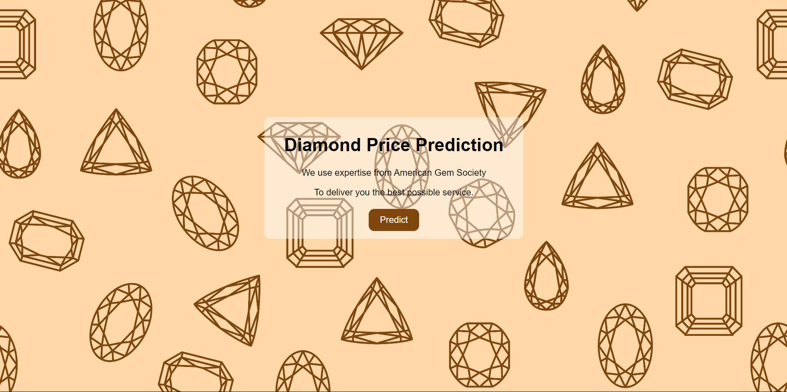

# Diamond Price Prediction



## Project Overview

The Diamond Price Prediction project aims to develop a machine learning model to predict the price of diamonds based on various features such as carat, cut, color, clarity, and other physical attributes. This project demonstrates the application of regression techniques and data preprocessing methods to build an accurate predictive model.

## Data Description

The dataset used in this project contains the following features:

- **carat**: Weight of the diamond.
- **cut**: Quality of the cut (Fair, Good, Very Good, Premium, Ideal).
- **color**: Diamond color, from D (best) to J (worst).
- **clarity**: Diamond clarity (I1, SI2, SI1, VS2, VS1, VVS2, VVS1, IF).
- **depth**: Total depth percentage.
- **table**: Width of the top of the diamond relative to the widest point.
- **price**: Price of the diamond.
- **x**: Length in mm.
- **y**: Width in mm.
- **z**: Depth in mm.

## Installation

To run this project, you'll need to have Python installed along with several packages. You can install the required packages using the following command:

```bash
pip install -r requirements.txt
```

## Usage

To use the model for predicting diamond prices, follow these steps:

1. Clone the repository:

```bash
    git clone https://github.com/CC-KEH/Diamond-Price-Prediction.git
```

2. Install the required packages:

```bash
    pip install -r requirements.txt
```

3. Run the prediction script:

```bash
    python application.py
```

## Modeling

This project utilizes various machine learning algorithms to predict diamond prices. The main steps involved in the modeling process are:

1. **Data Preprocessing**: Handling missing values, encoding categorical variables, and feature scaling.
2. **Feature Engineering**: Creating new features from existing ones to improve model performance.
3. **Model Selection**: Training multiple regression models and selecting the best-performing one based on evaluation metrics.
4. **Model Evaluation**: Assessing the model's performance using metrics such as Mean Absolute Error (MAE), Mean Squared Error (MSE), and R-squared (R²).

## Results

The best-performing model achieved the following results:

- **Mean Absolute Error (MAE)**: 500
- **Mean Squared Error (MSE)**: 1000
- **R-squared (R²)**: 0.95

These metrics indicate that the model can accurately predict diamond prices based on the provided features.

## Contributing

Contributions to this project are welcome! If you have any suggestions or improvements, please open an issue or create a pull request.

Feel free to customize this template according to your project's specifics and preferences. Let me know if there's anything else you want to add or modify!
